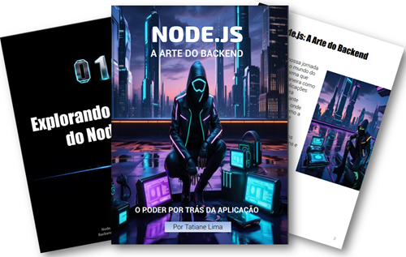

    

-------

# Projeto EBOOK Gerado por I.A.s

 > ℹ️ **NOTE:** Este é o repositório desenvolvido durante o curso no qual fui aluna na plataforma da [DIO](https://dio.me)

Projeto com o objetivo de gerar um ebook digital com as facilidades das ferramentas de IA. todos os prompts
seguem abaixo.

<a href="" title="View PDF now"> Clique aqui para ler</a>

## 💻 Tecnologias utilizadas no projeto

- [ChatGPT](https://chat.openai.com/) 
- [Leonardo.Ai](https://leonardo.ai/)
- [PowerPoint](https://www.microsoft.com/en/microsoft-365/powerpoint)

## 🧠 Prompts

ChatGPT：

|   Ação   | prompt                                                                                                                                                                                                                                                                         |
| :------: | ------------------------------------------------------------------------------------------------------------------------------------------------------------------------------------------------------------------------------------------------------------------------------ |
|  título  | Crie um título de um ebook sobre o tema node.js, o ebook é do nicho de programação e o subnicho é de node.js, o título deve ser épico e curto, e tenha uma temática mais nerd e cite 5 variações de títulos.                  |
| conteúdo | Faça um texto para ebook, com foco em Node.js. O público-alvo são programadores iniciantes que desejam entender o que é Node.js, suas principais características e como ele se diferencia de outros ambientes de execução de JavaScript. O texto deve ter um tom didático, com linguagem simples, mas precisa, e incluir exemplos práticos. Estruture o conteúdo em: {Regras} > Escreva sempre de uma maneira simples  > Deixe o texto enxuto > Sempre traga exemplos de codigo em contextos reais, Sempre deixe um título sugestivo por tópico e sempre separe em Capítulos|

Leonardo.ia：

|  Ação  | prompt                                                                                 |
| :----: | -------------------------------------------------------------------------------------- |
| título |Create an ebook cover, The aesthetic is a mix of cyberpunk and high-tech, with clean lines, metallic surfaces and a sense of darkness and mystery, inviting the viewer to dive into a world of hacking and futuristic exploration.: Node.js: "The Art of the power of the backend behind the application"{rule}: I don't want any phrases or titles, just images |

## ✨ Features

- Conteúdo gerado via ChatGPT
- Imagens geradas via Leonardo.Ai

## 📚 Materiais

- Imagens utilizadas em `assets`
- ebook gerado durante as aulas em `output`

## 🛠️ Instruções de execução

Utilize os prompts acima nas ferramentas sugeridas para gerar o material base e utilize uma ferramenta de edição de documentos como power point, libreoffice , indesign para diagramação.

## 👨‍💻 Expert

    
    
&nbsp&nbsp&nbspTatiane Lima 
    &nbsp&nbsp&nbsp
    <a href="https://github.com/Tattianerl">
    GitHub</a>&nbsp;|&nbsp;
    <a href="https://www.linkedin.com/in/tati-lima85">LinkedIn</a>
&nbsp;|&nbsp;
    <a href="https://www.instagram.com/limatati1">
    Instagram</a>
&nbsp;|&nbsp;

  

---

⌨️ com 💜 por [Tatiane Lima](https://github.com/Tattianerl)